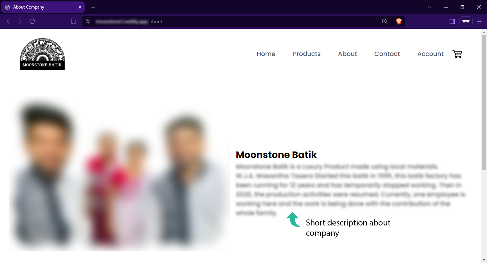
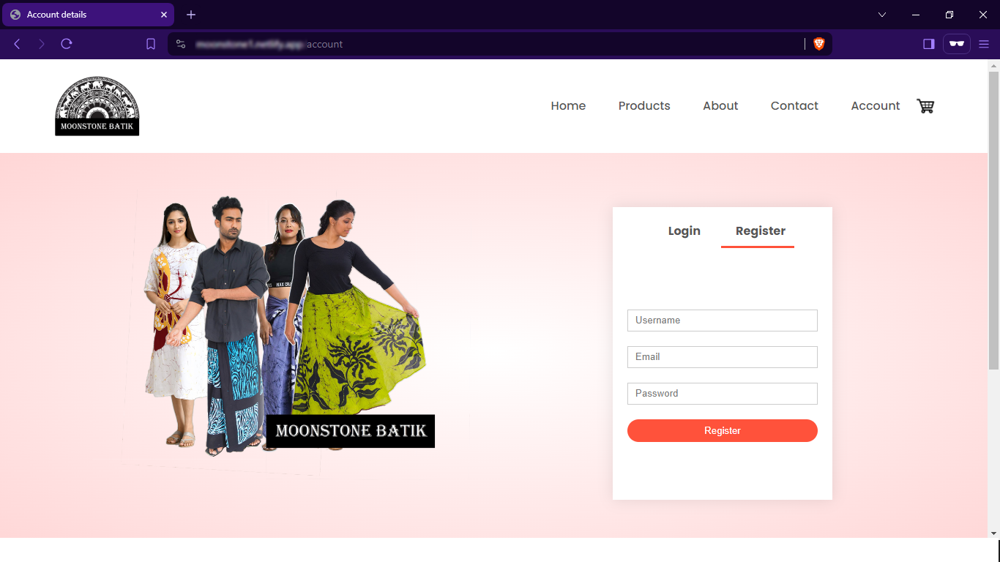
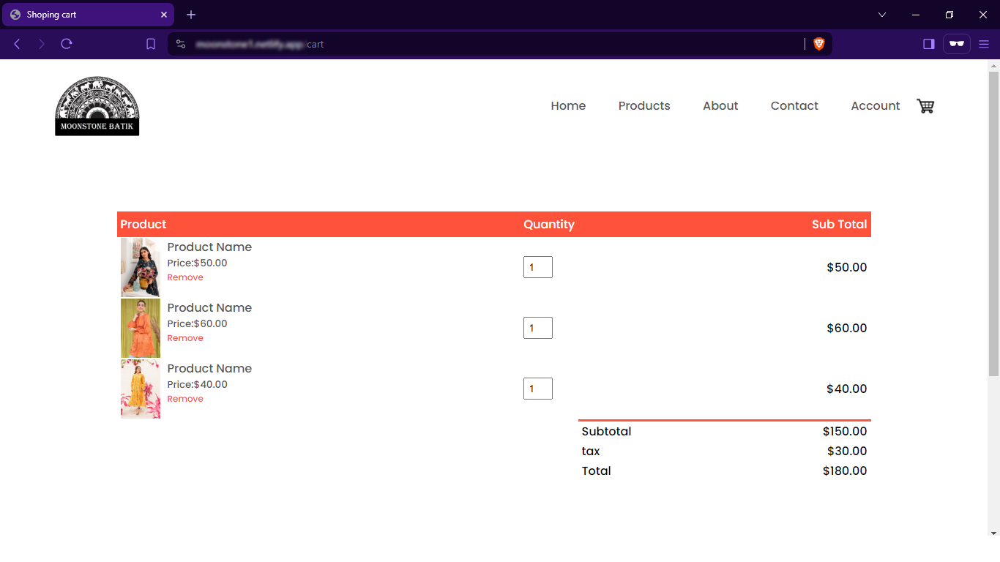
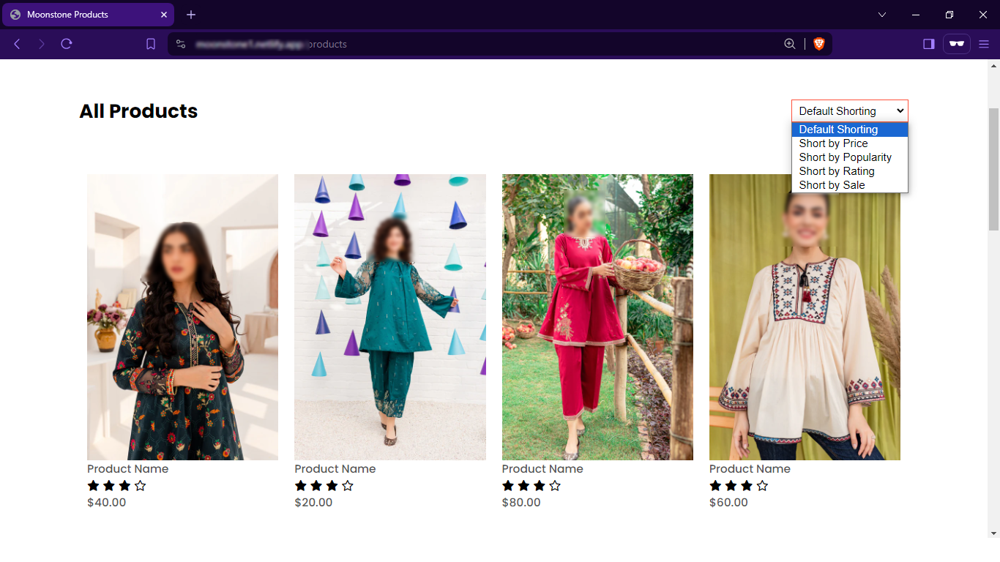

# 
Moonstone-Batik-Ecommerce-Website 

This repository contains the source code for a basic e-commerce website built using HTML for structure, CSS for styling, and PHP for server-side functionality (limited by the constraints of using only these technologies). 

# <h2>Key Features</h2>
- Add Product
- Delete Product
- User interface for browsing products
- A basic shopping cart

This project is intended as a basic demonstration of e-commerce website development concepts using HTML, CSS, and PHP. It may not include advanced features like secure user accounts, complex shopping cart logic, or payment processing. For production-ready e-commerce solutions, consider exploring established frameworks and security best practices.

# <h2>Preview</h2>

  
<h4>Home Page</h4>

<h4>Products</h4>

<h4>About</h4>

<h4>Contacts</h4>

<h4>Register</h4>

<h4>Shopping Cart</h4>

<h4>Shorting</h4>

